# img-rect-approx
Approximate an image by drawing rectangles at random. Requires the [Pillow](https://python-pillow.org) module.

Table of contents:
* [How it works](#how-it-works)
* [Command line arguments](#command-line-arguments)
* [Example &ndash; Doom](#example--doom)
* [Example &ndash; Wolfenstein 3D](#example--wolfenstein-3d)
* [Example &ndash; pride flag](#example--pride-flag)
* [Example &ndash; Lena](#example--lena)

## How it works
1. Read an image file.
2. Create a canvas filled with the average color of the original image.
3. Paint a rectangle with a random position, size and color on the canvas.
4. Undo step 3 if it did not make the canvas more similar to the original image.
5. Go to step 3 unless enough rectangles have been painted.
6. Write the canvas to a PNG file.

## Command line arguments
*inputFile outputFile numberOfRectangles maxRectangleSize*
* *inputFile*: image file to read
  * must not have an alpha channel
* *outputFile*: PNG image file to write
  * will not be overwritten if already exists
* *numberOfRectangles*: how many rectangles to paint
  * optional but must be specified if *maxRectangleSize* needs to be specified
  * a nonnegative integer, default = 1000
  * greater value = better image quality but slower
* *maxRectangleSize*: maximum width and height of rectangles in pixels
  * optional
  * a positive integer, default = 20
  * must be less than or equal to *inputFile*'s width and height
  * smaller value = better quality and faster

## Example &ndash; Doom
Original title screen from *Doom* by id Software:

Image generated with command `python3 img-rect-approx.py doom.png doom-2000rect-max20px.png 2000 20` (31 seconds on my computer):

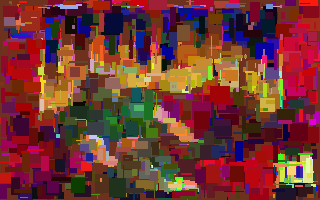

Image generated with command `python3 img-rect-approx.py doom.png doom-4000rect-max20px.png 4000 20` (142 seconds on my computer):

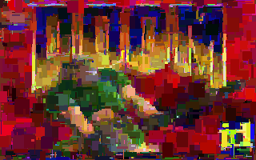

Image generated with command `python3 img-rect-approx.py doom.png doom-8000rect-max20px.png 8000 20` (885 seconds on my computer):

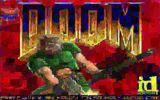

Image generated with command `python3 img-rect-approx.py doom.png doom-20000rect-max5px.png 20000 5` (85 seconds on my computer):

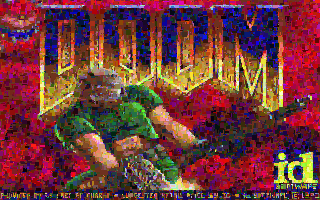

Image generated with command `python3 img-rect-approx.py doom.png doom-10000rect-max10px.png 10000 10` (110 seconds on my computer):

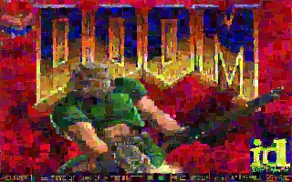

Image generated with command `python3 img-rect-approx.py doom.png doom-2000rect-max40px.png 2000 40` (431 seconds on my computer):

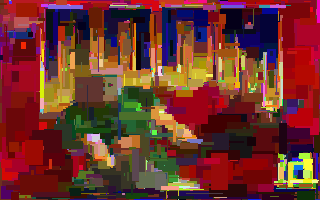

## Example &ndash; Wolfenstein 3D
Original title screen from *Wolfenstein 3D* by id Software:

Image generated with command `python3 img-rect-approx.py wolf3d.png wolf3d-2000rect-max20px.png 2000 20` (40 seconds on my computer):

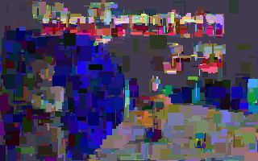

Image generated with command `python3 img-rect-approx.py wolf3d.png wolf3d-4000rect-max20px.png 4000 20` (206 seconds on my computer):

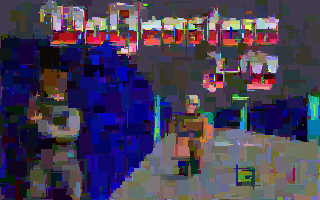

## Example &ndash; Pride flag
Original intersex-inclusive progressive pride flag ([source](https://commons.wikimedia.org/wiki/File:Intersex-inclusive_pride_flag.svg)):

Image generated with command `python3 img-rect-approx.py pride.png pride-2000rect-max20px.png 2000 20` (12 seconds on my computer):

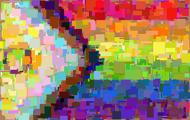

Image generated with command `python3 img-rect-approx.py pride.png pride-4000rect-max20px.png 4000 20` (106 seconds on my computer):

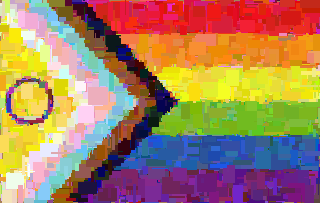

## Example &ndash; Lena
&ldquo;Lena&rdquo; by [Morten Rieger Hannemose](https://mortenhannemose.github.io/lena/):

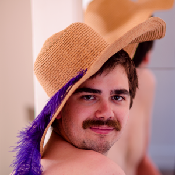

Image generated with command `python3 img-rect-approx.py lena.png lena-2000rect-max20px.png 2000 20` (26 seconds on my computer):

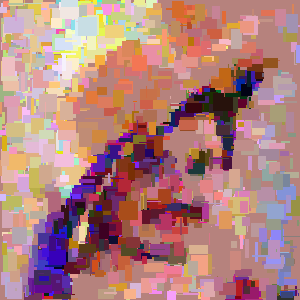

Image generated with command `python3 img-rect-approx.py lena.png lena-4000rect-max20px.png 4000 20` (127 seconds on my computer):

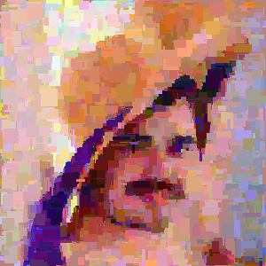
