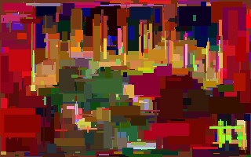
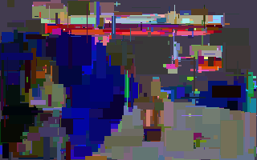

# img-rect-approx
Approximate an image by drawing rectangles at random on a blank canvas. Continues forever and saves an image every 10 rounds. Slow. Requires the [Pillow](https://python-pillow.org) module.

Sources of test files:
* `doom.png`: screenshot of *Doom* by id Software
* `wolf3d.png`: screenshot of *Wolfenstein 3D* by id Software

Table of contents:
* [Command line arguments](#command-line-arguments)
* [Example &ndash; Doom](#example-doom)
* [Example &ndash; Wolfenstein 3D](#example-wolfenstein-3d)

## Command line arguments
*inputFile outputFilePrefix*

## Example &ndash; Doom
This command:

`python3 img-rect-approx.py doom.png rect`

will write `rect010.png`, `rect020.png`, etc., and print this (the exact numbers vary):

```
Reading image...
Initial difference: 21065858
Difference after rectangle 1: 21050255 (99.9% of initial)
Difference after rectangle 2: 21048061 (99.9% of initial)
Difference after rectangle 3: 21044863 (99.9% of initial)
Difference after rectangle 4: 21041325 (99.9% of initial)
Difference after rectangle 5: 21039976 (99.9% of initial)
Difference after rectangle 6: 21033058 (99.8% of initial)
Difference after rectangle 7: 21031208 (99.8% of initial)
Difference after rectangle 8: 21019851 (99.8% of initial)
Difference after rectangle 9: 21016123 (99.8% of initial)
Difference after rectangle 10: 21011175 (99.7% of initial)
Writing rect010.png...
Difference after rectangle 11: 21010499 (99.7% of initial)
```

(and so on)

The original image and an approximation with 1000 rectangles:




## Example &ndash; Wolfenstein 3D

The original image and an approximation with 1000 rectangles:



