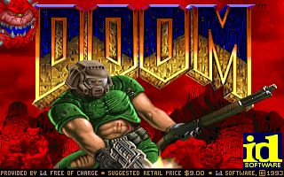
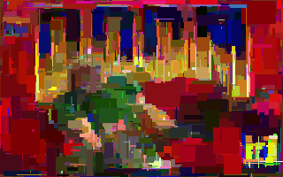
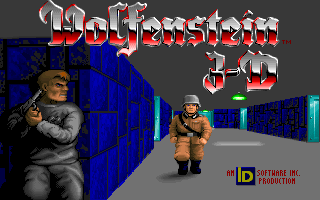
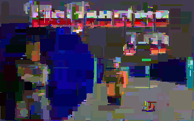

# img-rect-approx
Approximate an image by drawing rectangles at random on a blank canvas. Continues forever and saves an image every 10 rounds. Slow. Requires the [Pillow](https://python-pillow.org) module.

Table of contents:
* [Command line arguments](#command-line-arguments)
* [Example &ndash; Doom](#example--doom)
* [Example &ndash; Wolfenstein 3D](#example--wolfenstein-3d)
* [Example &ndash; pride flag](#example--pride-flag)
* [Sources of test files](#sources-of-test-files)

## Command line arguments
*inputFile outputFilePrefix*

## Example &ndash; Doom
This command will read `doom.png` and write `rect0100.png`, `rect0200.png`, etc., every 100 rectangles:

`python3 img-rect-approx.py doom.png rect`

The original image and an approximation with 2000 rectangles:

## Example &ndash; Wolfenstein 3D
The original image and an approximation with 2000 rectangles:

## Example &ndash; Pride flag
The original image and an approximation with 2000 rectangles:

## Sources of test files
* `doom.png`: screenshot of *Doom* by id Software
* `rainbow.png`: [Wikimedia Commons &ndash; Intersex-inclusive pride flag](https://commons.wikimedia.org/wiki/File:Intersex-inclusive_pride_flag.svg)
* `wolf3d.png`: screenshot of *Wolfenstein 3D* by id Software
